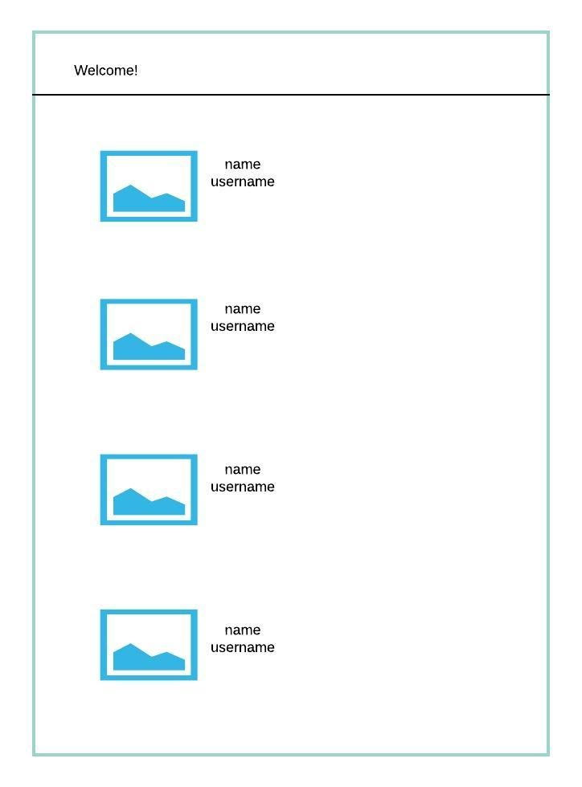

# Welcome to Four Legs or Fly™

We are an agency that employs experts in the field of 4-legged animals and birds, and we just hired you to build our recruiting site!

Our candidates are provided to us through our partner [randomUser]("https://randomuser.me/api?results=10") and they give us 10 candidates at a time.

As the developer, your job is to create a portal where our recruiter can view see a list of the candidates image, name and username.

However, because we beleive firmly in a high standard of excellence, candidates that do not have a four-legged animal, or a bird in their username will be removed from consideration.

# Project Initialization

1. Fork and clone this repository
1. Inside of the project directory, run `npm install` to install the dependencies.
1. Verify the application is working by running `npm start`.

# Project Tasks

The previous developer on this project didn't get too far before we found out they only liked snakes. So you'll pick up where they left off.

1. Currently, the greeting only says "Welcome!".  We would like that to display "Four Legs or Fly" instead.  However, this may change in the future. As such, the text should not be hardcoded in the component, it should be taken in as a prop. Get this done before moving on to other tasks.

1. Next up, the application should show all 10 applicants from our partner when the page first loads. If it's taking a while to load the applicants, then "Loading..." should be displayed instead. In short, show either "Loading...", or the list of profiles when the component first mounts.

> A Profile consists of the candidates image, their name, and their username

1. Finally, this is where we weed out the candidates that don't fit our vision.  If I see a username that doesn't have a four-legged animal or a bird in it then I should be able to click on the candiates image to remove them from the list. 

> This is a manual process, so if I accidentally click on a person that _does_ have a 4-legged animal or bird, and that user disappears, that won't count against you and is considered my bad.

I had my designer create a mockup of what the application should look like once the candidates load up:

